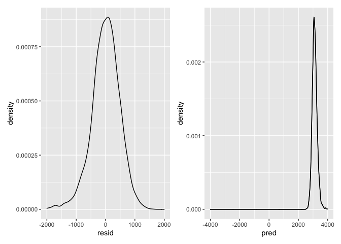
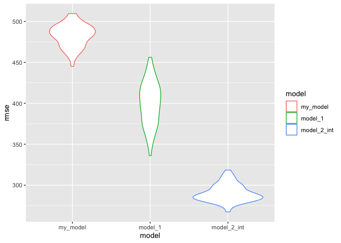
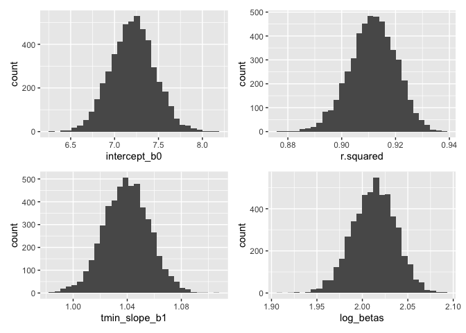

Homework 6
================
Onyeka Isamah

# Problem 1

## Importing and cleaning the data

-   Converted numeric to factor where appropriate (`babysex`, `frace`,
    `mrace`, `malform`)
-   Checked for missing data - doesn’t not appear to be any missing data

``` r
birthweight = 
  read_csv("./birthweight.csv")
```

    ## Rows: 4342 Columns: 20

    ## ── Column specification ────────────────────────────────────────────────────────
    ## Delimiter: ","
    ## dbl (20): babysex, bhead, blength, bwt, delwt, fincome, frace, gaweeks, malf...

    ## 
    ## ℹ Use `spec()` to retrieve the full column specification for this data.
    ## ℹ Specify the column types or set `show_col_types = FALSE` to quiet this message.

``` r
birthweight_clean = 
  birthweight %>%  janitor::clean_names() %>% 
  
mutate(
    babysex = factor(babysex),
    frace = factor(frace),
    mrace = factor(mrace),
    malform = factor(malform)
) 

#looking for missing data by summing any missing data points##
sum(is.na(birthweight_clean))
```

    ## [1] 0

### Proposed regression model for birthweight

*Modeling process*: Research suggests that the mother’s height and
weight impacts a baby’s birth weight. Based on this hypothesized
structure that possible varibles that underly birthweight, I am
proposing a regression model with the predictor variables `delwt`,
mother’s weight at delivery (pounds), `mheight`: mother’s height
(inches), `wtgain`: mother’s weight gain during pregnancy (pounds).

**Model:**

``` r
fit = lm(bwt ~ delwt + mheight + wtgain, data = birthweight_clean)
## using linear model ##
## obtaining p-value and tidying summary coefficient ##
fit %>% broom::tidy() %>% 
  knitr::kable(digits = 3)
```

| term        | estimate | std.error | statistic | p.value |
|:------------|---------:|----------:|----------:|--------:|
| (Intercept) |  969.818 |   178.336 |     5.438 |       0 |
| delwt       |    3.885 |     0.404 |     9.617 |       0 |
| mheight     |   22.100 |     3.061 |     7.219 |       0 |
| wtgain      |    7.961 |     0.748 |    10.642 |       0 |

## Model Diagnostics - plotting residuals

-   Residuals for the proposed model appear to be normally distributed,
    however the predictions appear to be skewed.

``` r
modelr:: add_residuals(birthweight_clean, fit)
```

    ## # A tibble: 4,342 × 21
    ##    babysex bhead blength   bwt delwt fincome frace gaweeks malform menarche
    ##    <fct>   <dbl>   <dbl> <dbl> <dbl>   <dbl> <fct>   <dbl> <fct>      <dbl>
    ##  1 2          34      51  3629   177      35 1        39.9 0             13
    ##  2 1          34      48  3062   156      65 2        25.9 0             14
    ##  3 2          36      50  3345   148      85 1        39.9 0             12
    ##  4 1          34      52  3062   157      55 1        40   0             14
    ##  5 2          34      52  3374   156       5 1        41.6 0             13
    ##  6 1          33      52  3374   129      55 1        40.7 0             12
    ##  7 2          33      46  2523   126      96 2        40.3 0             14
    ##  8 2          33      49  2778   140       5 1        37.4 0             12
    ##  9 1          36      52  3515   146      85 1        40.3 0             11
    ## 10 1          33      50  3459   169      75 2        40.7 0             12
    ## # … with 4,332 more rows, and 11 more variables: mheight <dbl>, momage <dbl>,
    ## #   mrace <fct>, parity <dbl>, pnumlbw <dbl>, pnumsga <dbl>, ppbmi <dbl>,
    ## #   ppwt <dbl>, smoken <dbl>, wtgain <dbl>, resid <dbl>

``` r
modelr::add_predictions(birthweight_clean, fit)
```

    ## # A tibble: 4,342 × 21
    ##    babysex bhead blength   bwt delwt fincome frace gaweeks malform menarche
    ##    <fct>   <dbl>   <dbl> <dbl> <dbl>   <dbl> <fct>   <dbl> <fct>      <dbl>
    ##  1 2          34      51  3629   177      35 1        39.9 0             13
    ##  2 1          34      48  3062   156      65 2        25.9 0             14
    ##  3 2          36      50  3345   148      85 1        39.9 0             12
    ##  4 1          34      52  3062   157      55 1        40   0             14
    ##  5 2          34      52  3374   156       5 1        41.6 0             13
    ##  6 1          33      52  3374   129      55 1        40.7 0             12
    ##  7 2          33      46  2523   126      96 2        40.3 0             14
    ##  8 2          33      49  2778   140       5 1        37.4 0             12
    ##  9 1          36      52  3515   146      85 1        40.3 0             11
    ## 10 1          33      50  3459   169      75 2        40.7 0             12
    ## # … with 4,332 more rows, and 11 more variables: mheight <dbl>, momage <dbl>,
    ## #   mrace <fct>, parity <dbl>, pnumlbw <dbl>, pnumsga <dbl>, ppbmi <dbl>,
    ## #   ppwt <dbl>, smoken <dbl>, wtgain <dbl>, pred <dbl>

``` r
plot1 =
  modelr:: add_residuals(birthweight_clean, fit) %>% 
  ggplot(aes(x = resid)) + geom_density() + xlim(-2000, 2000)


plot2 = modelr:: add_predictions(birthweight_clean, fit) %>% 
  ggplot(aes(x = pred)) + geom_density() + geom_density() + xlim(-4000, 4000)

plot1 + plot2
```

    ## Warning: Removed 6 rows containing non-finite values (stat_density).

    ## Warning: Removed 4 rows containing non-finite values (stat_density).

    ## Warning: Removed 4 rows containing non-finite values (stat_density).

<!-- -->

## Model comparison

``` r
set.seed(10)

cv_df = crossv_mc(birthweight_clean, 100) %>% 
  mutate(tain = map(train,as_tibble),
         test = map(test, as_tibble)) %>%
  #creating other models, model 1 length at birth and gestational age as predictors (main effects only), model 2 head circumference, length, sex, and all interactions (including the three-way interaction)##
  
  mutate(
    my_model = map(train, ~lm(bwt ~ delwt + mheight + wtgain, data = birthweight_clean)),
    model_1 = map(train, ~lm(bwt ~ blength, gaweeks, data = .x)),
    model_2_int = map(train, ~lm(bwt~ bhead + blength + babysex + bhead*blength + bhead*babysex + blength*babysex +bhead*babysex, data = .x))
  )  %>% 
   #creating RMSE for the 3 models ##
  mutate(
    rmse_my_model = map2_dbl(my_model, test, ~rmse(model = .x, data = .y)),
    rmse_model_1 = map2_dbl(model_1, test, ~rmse(model = .x, data = .y)),
    rmse_model_2_int = map2_dbl(model_2_int, test,~ rmse(model = .x, data = .y)))
```

-   **Plotting RMSE for the 3 models**:

We can see that model 2, the model with the interaction terms, has the
smallest RMSE values in comparison to my proposed model, and the model
with just the main effects (model 1). Out of these 3 models, model 2 is
the best model since it has the least prediction errors as indicated by
the RMSE distribtuion plot.

``` r
cv_df %>% 
  select(starts_with('rmse')) %>% 
  pivot_longer(
    everything(),
    names_to = 'model',
    values_to = 'rmse',
    names_prefix = 'rmse_' ) %>% 
  mutate(model = fct_inorder(model)
  ) %>% 
## plot ##
ggplot(aes(x= model, y= rmse, color= model)) + geom_violin()
```

<!-- -->

# Problem 2:

Importing data set:

``` r
weather_df = 
  rnoaa::meteo_pull_monitors(
    c("USW00094728"),
    var = c("PRCP", "TMIN", "TMAX"), 
    date_min = "2017-01-01",
    date_max = "2017-12-31") %>%
  mutate(
    name = recode(id, USW00094728 = "CentralPark_NY"),
    tmin = tmin / 10,
    tmax = tmax / 10) %>%
  select(name, id, everything())
```

    ## Registered S3 method overwritten by 'hoardr':
    ##   method           from
    ##   print.cache_info httr

    ## using cached file: ~/Library/Caches/R/noaa_ghcnd/USW00094728.dly

    ## date created (size, mb): 2021-10-14 17:10:38 (7.604)

    ## file min/max dates: 1869-01-01 / 2021-10-31

-   We’ll focus on a simple linear regression with `tmax` as the
    response and `tmin` as the predictor.
-   We are interested in the distribution of two quantities estimated
    from these data: **r̂2and log(β̂0∗β̂1)**

1.  Getting the estimates (r-squared and log for beta parameter
    estimates)

``` r
bootstrap_df = weather_df %>%  
  bootstrap(n = 5000) %>% 
  mutate(
    models = map(strap, ~lm(tmax~tmin, data = .x)),
    results = map(models, broom::tidy),
    results_glance = map(models, broom::glance)) %>% 
  select(-strap, models) %>% 
unnest(results_glance) %>% ## getting r.squared values##
  select(.id, results, r.squared) %>% 
  unnest(results) %>% ##getting estimates##
  select(.id, r.squared, term, estimate) %>% 
  mutate(
term = recode(term, '(Intercept)' = "intercept_b0", tmin= "tmin_slope_b1")) %>% 
  pivot_wider(names_from = term, values_from = estimate) %>%  ##tidying output##
  mutate(log_betas = log(intercept_b0*tmin_slope_b1)) ##taking the log of the slope and intercept estimates)##
    bootstrap_df %>% head() %>%  knitr::kable()
```

| .id  | r.squared | intercept\_b0 | tmin\_slope\_b1 | log\_betas |
|:-----|----------:|--------------:|----------------:|-----------:|
| 0001 | 0.9167771 |      6.935879 |        1.055945 |   1.991144 |
| 0002 | 0.9028614 |      7.349399 |        1.016449 |   2.010933 |
| 0003 | 0.9211041 |      6.716021 |        1.056921 |   1.959856 |
| 0004 | 0.9087535 |      7.365710 |        1.026227 |   2.022724 |
| 0005 | 0.8920590 |      7.576793 |        1.020380 |   2.045265 |
| 0006 | 0.9138967 |      7.317395 |        1.051170 |   2.040158 |

2.  Plotting the distribution of intercept estimates, slope estimates,
    r-squares values, and log beta estimates.

-   *Description*: Using the bootstrap method for 5000 repeated samples,
    the distribution of all of the estimates appear to be normally
    distributed.

``` r
intercept_dist = ggplot(bootstrap_df, aes(x = intercept_b0)) + geom_histogram()

r_squared_dist =  ggplot(bootstrap_df, aes(x = r.squared)) + geom_histogram()
  
b1_dist =  ggplot(bootstrap_df, aes(x = tmin_slope_b1)) + geom_histogram()
  
log_beta_dist = ggplot(bootstrap_df, aes(x = log_betas)) + geom_histogram()

intercept_dist + r_squared_dist + b1_dist + log_beta_dist
```

    ## `stat_bin()` using `bins = 30`. Pick better value with `binwidth`.
    ## `stat_bin()` using `bins = 30`. Pick better value with `binwidth`.
    ## `stat_bin()` using `bins = 30`. Pick better value with `binwidth`.
    ## `stat_bin()` using `bins = 30`. Pick better value with `binwidth`.

<!-- -->

3.  Using the 5000 estimates, identify the .5% and 97.5% quantiles to
    provide a 95% confidence interval for r̂2 and log(β̂0∗β̂1)

-   95% confidence interval for `r.squared` = .894, .927

-   95% confidence interval for `log_betas` = .1.966, 2.058 .

``` r
bootstrap_df %>% 
  summarize(
            upper_r2 = quantile(r.squared, .975),
            lower_r2 = quantile(r.squared, .025),
            upper_log_betas = quantile(log_betas, .975),
            lower_log_betas = quantile(log_betas, .025)
              ) %>% knitr::kable(digits = 3)
```

| upper\_r2 | lower\_r2 | upper\_log\_betas | lower\_log\_betas |
|----------:|----------:|------------------:|------------------:|
|     0.928 |     0.894 |             2.057 |             1.963 |
